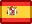
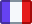

# Other languages

This is currently work in progress.

So far only the cards have been translated, based on lists shared online

I welcome help on the translation of the interface :)

*  [Spanish](spanish.html)
*  [French](french.html)
*  [German](german.html)
*  [Dutch](dutch.html)
*  [Italian](italian.html)
*  [Chinese](chinese.html)
*  [Danish](danish.html)
*  [Hungarian](hungarian.html)
* [Catalan](catalan.html)

